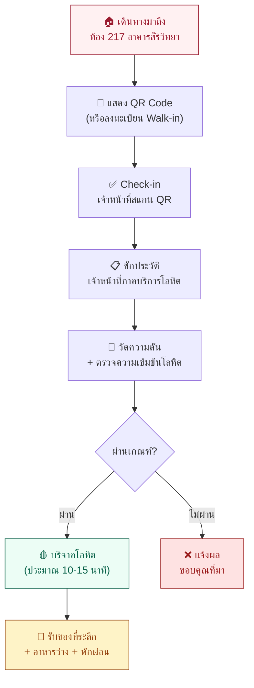

# 🩸 MUMT LoveUnit ครั้งที่ 9 — สรุปรายละเอียดกิจกรรม

## "เติมรักให้เต็ม Unit ต่อชีวิตด้วยโลหิตคุณ" ครั้งที่ 9

---

## 💡 งานนี้คืออะไร?

**MUMT LoveUnit** เป็นกิจกรรมบริจาคโลหิตประจำปีที่จัดโดย **คณะเทคนิคการแพทย์ มหาวิทยาลัยมหิดล** ร่วมกับ **ภาคบริการโลหิตแห่งชาติที่ 4 จังหวัดราชบุรี (สภากาชาดไทย)** เพื่อเปิดรับบริจาคโลหิตจากนักศึกษา บุคลากร และบุคคลทั่วไป โดยในปี 2569 นี้เป็นการจัดครั้งที่ 9

> ขอเชิญชวนทุกคนมาร่วมเป็นส่วนหนึ่งในการส่งต่อโอกาสและช่วยเหลือผู้ป่วยที่ต้องการโลหิต — เพียงการบริจาคโลหิตของคุณ **1 ครั้ง** อาจช่วยต่อชีวิตใครอีกหลายคน ✨

---

## 📌 ข้อมูลงาน (Event Details)

| รายการ | รายละเอียด |
|---|---|
| **ชื่องาน** | เติมรักให้เต็ม Unit ต่อชีวิตด้วยโลหิตคุณ ครั้งที่ 9 |
| **ชื่อภาษาอังกฤษ** | MUMT Blood Donation 2026 — LoveUnit #9 |
| **วันที่** | วันพุธที่ **16 กันยายน 2569** (Wednesday, 16 September 2026) |
| **เวลา** | **09:00 – 14:00 น.** (9:00 AM – 2:00 PM) |
| **สถานที่** | ห้องประชุม 217 ชั้น 2 อาคารสิริวิทยา คณะศิลปศาสตร์ มหาวิทยาลัยมหิดล วิทยาเขตศาลายา |
| **จัดโดย** | คณะเทคนิคการแพทย์ มหาวิทยาลัยมหิดล |
| **ร่วมกับ** | ภาคบริการโลหิตแห่งชาติที่ 4 จังหวัดราชบุรี (สภากาชาดไทย) |
| **เปิดรับ** | นักศึกษามหิดล, บุคลากรมหิดล, บุคคลทั่วไป |

---

## 🎯 วัตถุประสงค์ของกิจกรรม

1. **รวบรวมโลหิต** ส่งมอบให้ภาคบริการโลหิตแห่งชาติเพื่อช่วยเหลือผู้ป่วยทั่วประเทศ
2. **สร้างจิตสำนึก** ให้นักศึกษาและบุคลากรตระหนักถึงความสำคัญของการบริจาคโลหิต
3. **ให้ความรู้** เกี่ยวกับเกณฑ์มาตรฐานและการเตรียมตัวก่อนบริจาค ผ่านระบบ Self-Screening ออนไลน์
4. **สร้างประสบการณ์เชิงบวก** ให้ผู้บริจาคครั้งแรกไม่กลัว รู้สึกอบอุ่น และอยากกลับมาบริจาคอีก
5. **เชื่อมโยงวิชาชีพ** เทคนิคการแพทย์ ซึ่งเป็นผู้ตรวจวิเคราะห์โลหิตในห้องปฏิบัติการ กับการรับบริจาคโลหิตภาคสนาม

---

## 👤 ใครบริจาคได้บ้าง? (คุณสมบัติผู้บริจาค)

| เกณฑ์ | รายละเอียด |
|---|---|
| **อายุ** | 17 – 70 ปีบริบูรณ์ (ครั้งแรกไม่เกิน 60 ปี) |
| **น้ำหนัก** | ตั้งแต่ **45 กิโลกรัม** ขึ้นไป |
| **ความเข้มข้นโลหิต** | หญิง ≥ 12.5 g/dL / ชาย ≥ 13.0 g/dL |
| **สุขภาพ** | แข็งแรงดี ไม่มีไข้ ไม่เป็นหวัด |
| **การนอน** | นอนหลับพักผ่อนอย่างน้อย 5–6 ชั่วโมง |
| **ข้อห้าม** | ไม่มีโรคประจำตัวร้ายแรง, ไม่ตั้งครรภ์/ให้นมบุตร, ไม่มีประวัติเสี่ยงตามเกณฑ์สภากาชาดไทย |

> [!NOTE]
> สามารถตรวจสอบความพร้อมของตัวเองได้ล่วงหน้าผ่าน **ระบบ Self-Screening** บนเว็บไซต์ก่อนลงทะเบียน

---

## ✅ ข้อปฏิบัติก่อนบริจาค (Do's & Don'ts)

### สิ่งที่ควรทำ ✅
| # | รายละเอียด |
|---|---|
| 💧 | **ดื่มน้ำเปล่า 3–4 แก้ว** (500 มล.) ก่อนบริจาค 20–30 นาที |
| 🍽 | **รับประทานอาหารมื้อหลัก** ก่อนมาบริจาค (หลีกเลี่ยงของมัน) |
| 🌙 | **นอนหลับพักผ่อนให้เพียงพอ** อย่างน้อย 5–6 ชั่วโมง |

### สิ่งที่ควรหลีกเลี่ยง ❌
| # | รายละเอียด |
|---|---|
| 🍷 | งดเครื่องดื่ม **แอลกอฮอล์** อย่างน้อย 24 ชั่วโมง |
| 🚬 | งด **สูบบุหรี่** ก่อนและหลังบริจาคอย่างน้อย 1 ชั่วโมง |
| 🚫 | งด **อาหารไขมันสูง** เช่น ข้าวขาหมู แกงกะทิ ขนมหวาน |

---

## 🎁 ของที่ระลึกและสิทธิประโยชน์

### สิทธิพิเศษ 100 ท่านแรก 🏆

| เงื่อนไข | รายละเอียด |
|---|---|
| **ลงทะเบียนออนไลน์** | เป็น 100 ท่านแรกที่ลงทะเบียนผ่านเว็บไซต์ (นับตามลำดับ) |
| **มาถึงตามรอบเวลา** | ต้อง Check-in ที่หน้างานภายในรอบเวลาที่เลือกไว้ตอนลงทะเบียน |
| **บริจาคสำเร็จ** | ต้องบริจาคโลหิตสำเร็จในวันงาน |
| **ได้รับ** | 🎁 **ของที่ระลึกสุดพิเศษ Limited Edition** |

> [!IMPORTANT]
> หากมาช้ากว่ารอบเวลาที่เลือกไว้ → **สิทธิ์ของที่ระลึกพิเศษจะตกไป**

### ผู้บริจาคทุกท่าน 🎉
- ไม่ว่าจะลงทะเบียนออนไลน์ลำดับที่เท่าไหร่ หรือมาแบบ Walk-in **ก็ยังได้รับ:**
  - 🎁 ของรางวัลและของที่ระลึกอื่นๆ อีกมากมาย
  - 🥤 อาหารว่างและเครื่องดื่มบำรุงสุขภาพ
  - 📋 ใบรับรองการบริจาคโลหิต

---

## 🚶 ขั้นตอนในวันงาน

**รายละเอียดแต่ละขั้นตอน:**

| ขั้นตอน | ระยะเวลาโดยประมาณ | รายละเอียด |
|---|---|---|
| 1. เดินทางมาถึง | – | มาตามรอบเวลาที่เลือกไว้ (หรือเวลาที่สะดวก) |
| 2. แสดง QR / Walk-in | ~1 นาที | แสดง QR Code บนมือถือ ให้เจ้าหน้าที่สแกน / หรือลงทะเบียนหน้างาน |
| 3. ซักประวัติ | ~3–5 นาที | ตอบแบบสอบถามสุขภาพกับเจ้าหน้าที่สภากาชาด |
| 4. ตรวจร่างกาย | ~3–5 นาที | วัดความดันโลหิต, ชั่งน้ำหนัก, ตรวจความเข้มข้นเลือด (Hb) |
| 5. บริจาคโลหิต | ~10–15 นาที | เจาะเลือดบริจาค ปริมาณ 350–450 มล. |
| 6. พักผ่อน + ของที่ระลึก | ~10–15 นาที | นั่งพักผ่อน ดื่มน้ำ รับประทานอาหารว่าง รับของที่ระลึก |

> **รวมเวลาทั้งหมดโดยประมาณ: 30–45 นาที** (ขึ้นกับจำนวนคิว)

---

## 🗺 สถานที่จัดงาน

| รายการ | รายละเอียด |
|---|---|
| **อาคาร** | อาคารสิริวิทยา (Sirividhaya Building) |
| **ห้อง** | ห้องประชุม 217 ชั้น 2 |
| **คณะ** | คณะศิลปศาสตร์ มหาวิทยาลัยมหิดล |
| **วิทยาเขต** | ศาลายา |
| **ดูแผนที่** | เว็บไซต์กิจกรรม หน้า `/location` |

---

## 📞 ช่องทางติดต่อ

| ผู้ประสานงาน | เบอร์โทร |
|---|---|
| 📞 เปา | [09-6986-6245](tel:0969866245) |
| 📞 แตงโม | [06-5627-4319](tel:0656274319) |

**โซเชียลมีเดีย:** ติดตามข้อมูลอัปเดตได้ที่ **@mumt_loveunit**

---

## ❓ คำถามที่พบบ่อย (FAQ)

### 💉 เกี่ยวกับการบริจาค

| คำถาม | คำตอบ |
|---|---|
| บริจาคครั้งแรกกลัวมาก ทำอย่างไร? | เจ้าหน้าที่สภากาชาดมีประสบการณ์สูง จะดูแลตลอด ใช้เวลาเจาะเพียง 10–15 นาที ไม่เจ็บอย่างที่คิด |
| บริจาคแล้วจะเป็นลมไหม? | หากเตรียมร่างกายดี (นอนพอ ดื่มน้ำ กินข้าว) โอกาสน้อยมาก และมีเจ้าหน้าที่พยาบาลคอยดูแล |
| เลือดเก็บไปทำอะไร? | ส่งไปที่ภาคบริการโลหิตแห่งชาติ ตรวจคุณภาพ แยกส่วนประกอบ แล้วจ่ายให้ผู้ป่วยที่ต้องการ |
| บริจาคบ่อยแค่ไหนได้? | ผู้ชายทุก 3 เดือน / ผู้หญิงทุก 4 เดือน |
| ต้องนำบัตรประชาชนมาไหม? | แนะนำให้นำมา เพื่อยืนยันตัวตนกับเจ้าหน้าที่สภากาชาด |

### 💻 เกี่ยวกับระบบลงทะเบียน

| คำถาม | คำตอบ |
|---|---|
| ต้องลงทะเบียนออนไลน์ก่อนไหม? | ไม่บังคับ สามารถ Walk-in มาลงทะเบียนหน้างานได้ แต่ลงทะเบียนออนไลน์ล่วงหน้าจะสะดวกและรวดเร็วกว่า |
| ลืม QR Code ทำอย่างไร? | เข้าหน้า "ค้นหาประวัติ" (`/lookup`) กรอกเบอร์โทร + ชื่อ + นามสกุล → ระบบดึง QR กลับมาให้ |
| ลงทะเบียนแล้วแต่มาไม่ได้? | ไม่เป็นไร ไม่มีค่าปรับ ไม่มีผลกระทบใดๆ |
| ลงทะเบียนแทนคนอื่นได้ไหม? | ได้ กรอกชื่อและเบอร์โทรของผู้ที่จะมาบริจาคจริง |
| รอบเวลาที่เลือกตอนลงทะเบียนคืออะไร? | เป็น "รอบเวลาแนะนำเดินทางมาถึง" เพื่อสำรวจว่าจะมาช่วงไหน ไม่มีจำกัดจำนวนคน ใครจะเลือกรอบไหนก็ได้ |

---

## 🔗 ลิงก์สำคัญบนเว็บไซต์

| หน้า | เส้นทาง | คำอธิบาย |
|---|---|---|
| หน้าแรก | `/` | ข้อมูลกิจกรรม สิทธิประโยชน์ ขั้นตอนบริจาค |
| ประเมินสุขภาพ | `/screening` | แบบประเมินตนเอง 24 ข้อ ตามมาตรฐานสภากาชาดไทย |
| ลงทะเบียน | `/register` | ลงทะเบียนจองรอบเวลาออนไลน์ (3 ขั้นตอน) |
| ตั๋วบริจาค | `/registration/[code]` | QR Pass สำหรับแสดงวันงาน |
| เตรียมตัว | `/prepare` | คู่มือข้อปฏิบัติก่อน-หลังบริจาค |
| ค้นหา QR | `/lookup` | กรณีลืม QR Code (ใส่เบอร์+ชื่อ) |
| แผนที่ | `/location` | แผนที่สถานที่จัดงาน |
| โปสเตอร์ | `/poster` | ดาวน์โหลดโปสเตอร์ประชาสัมพันธ์ (TH/EN) |
| ศึกษามาตรฐานแล็บ | `/knowledge` | ความรู้มาตรฐานการตรวจแล็บ |
