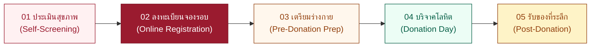

# 📋 โปรโตคอลการลงทะเบียนบริจาคโลหิตล่วงหน้า (Pre-Donation Registration Protocol)

**MUMT Blood Donation 2026 — "เติมรักให้เต็ม Unit ต่อชีวิตด้วยโลหิตคุณ ครั้งที่ 9"**
**📅 พุธที่ 16 กันยายน 2569 | 🕘 09:00 – 14:00 น.**
**📍 ห้องประชุม 217 อาคารสิริวิทยา คณะศิลปศาสตร์ ม.มหิดล ศาลายา**

---

## 🎬 สรุปภาพรวม — สำหรับเปิดคลิปสอน

> [!TIP]
> ระบบลงทะเบียนออนไลน์ LoveUnit ให้ผู้บริจาคจองรอบเวลาล่วงหน้าผ่านมือถือ ใช้เวลาเพียง **2 นาที** ไม่ต้องดาวน์โหลดแอปใดๆ เปิดได้ทุกเบราว์เซอร์

### Flow ทั้งหมดของผู้บริจาค (5 ขั้นตอนในภาพรวม)

---

## 📖 โปรโตคอลขั้นตอน — ละเอียดทีละจอ

---

### 🟢 PHASE 0: เข้าสู่เว็บไซต์ (Homepage)

| รายการ | รายละเอียด |
|---|---|
| **URL** | เข้าเว็บไซต์กิจกรรม (หน้าแรก `/`) |
| **สิ่งที่เห็น** | Hero Banner กิจกรรม, ข้อมูลวัน-เวลา-สถานที่, ของที่ระลึก |
| **จุดสำคัญ** | ข้อมูลสิทธิพิเศษ "100 ท่านแรก" ที่ลงทะเบียน เดินทางมางาน และบริจาคสำเร็จ |
| **สิ่งที่ต้องทำ** | อ่านข้อมูล แล้วกดปุ่ม **"ประเมินสุขภาพ"** หรือ **"ลงทะเบียนบริจาค"** |

> [!IMPORTANT]
> **แนะนำให้ทำ Self-Screening ก่อนลงทะเบียน** เพื่อตรวจสอบว่าสุขภาพพร้อมบริจาคหรือไม่ ช่วยลดความผิดหวังในวันจริง

---

### 🟡 PHASE 1: แบบประเมินสุขภาพตนเอง (Self-Screening) — `/screening`

> [!NOTE]
> ขั้นตอนนี้ **ไม่บังคับ** แต่แนะนำอย่างยิ่ง เพื่อให้ผู้บริจาคทราบล่วงหน้าว่ามีข้อห้ามหรือไม่

#### สิ่งที่ระบบถาม:
แบบประเมินอิงมาตรฐาน **ศูนย์บริการโลหิตแห่งชาติ สภากาชาดไทย (พ.ศ. 2564 & 2567)** แบ่งเป็นหมวดหมู่:

| หมวด | ตัวอย่างคำถาม |
|---|---|
| **สุขภาพทั่วไป** | น้ำหนัก ≥ 45 กก., อายุ 17–70 ปี, นอนหลับเพียงพอ |
| **โรคประจำตัว** | โรคหัวใจ, เบาหวาน, ความดัน, มะเร็ง |
| **ยาและหัตถการ** | ยาปฏิชีวนะ, ทำฟัน, ผ่าตัด, สักลาย |
| **ความเสี่ยงการติดเชื้อ** | การเดินทางเข้าพื้นที่มาลาเรีย, พฤติกรรมเสี่ยง |
| **การตั้งครรภ์/ให้นมบุตร** | กำลังตั้งครรภ์, คลอดบุตร, ให้นมบุตร |

#### วิธีตอบ:
- ตอบ **ใช่ / ไม่ใช่** ทีละข้อ
- ระบบจะแสดง Progress Bar ด้านบน
- กดปุ่ม **"ถัดไป"** เพื่อข้ามไปหมวดถัดไป
- มีปุ่ม **"ทดลองตรวจด่วน (สุขภาพสมบูรณ์)"** สำหรับผู้ที่แน่ใจว่าสุขภาพดี

#### ผลประเมิน (4 ระดับ):

| ผลลัพธ์ | สัญลักษณ์ | ความหมาย | สิ่งที่ทำต่อ |
|---|---|---|---|
| ✅ **ELIGIBLE** | 🟢 เขียว | ผ่านเกณฑ์ สามารถบริจาคได้ | กด **"ไปลงทะเบียนจองรอบเวลา"** |
| ℹ️ **CAUTION** | 🔵 น้ำเงิน | มีข้อควรระวัง แต่ไม่ห้ามเด็ดขาด | ปรึกษาเจ้าหน้าที่ในวันจริง + ลงทะเบียนได้ |
| ⚠️ **TEMPORARY DEFERRAL** | 🟡 เหลือง | ไม่ผ่านชั่วคราว (มีวันคาดว่ากลับมาได้) | อ่านข้อปฏิบัติ / รอจนครบกำหนด |
| ❌ **PERMANENT DEFERRAL** | 🔴 แดง | ไม่สามารถบริจาคได้ | อ่านคำแนะนำเพิ่มเติม |

> [!TIP]
> **สำหรับคลิปสอน:** แนะนำให้กดปุ่ม "ทดลองตรวจด่วน" เพื่อ Demo ให้เห็นหน้าผลลัพธ์ ELIGIBLE แล้วค่อยกด "ไปลงทะเบียนจองรอบเวลาทันที"

---

### 🔴 PHASE 2: ลงทะเบียนจองรอบเวลาออนไลน์ (Online Registration) — `/register`

> [!IMPORTANT]
> นี่คือ **ขั้นตอนหลัก** ที่ต้อง Demo ในคลิปอย่างละเอียด — เป็น Wizard 3 ขั้นตอน

---

#### STEP 1 ของ 3: ข้อมูลส่วนตัว

| ฟิลด์ | บังคับ? | รายละเอียด | ตัวอย่างข้อมูล |
|---|---|---|---|
| **ชื่อจริง** | ✅ บังคับ | ภาษาไทย | `สมชาย` |
| **นามสกุล** | ✅ บังคับ | ภาษาไทย | `ใจดี` |
| **เบอร์โทรศัพท์มือถือ** | ✅ บังคับ | 9-10 หลัก (ใช้ค้นหา QR กรณีลืมด้วย) | `0812345678` |
| **อีเมล** | ❌ ไม่บังคับ | ถ้าระบุ → ระบบส่ง QR Code ทางอีเมลอัตโนมัติ | `somchai@example.com` |

**จุดที่ต้องเน้นในคลิป:**
- 📱 **เบอร์โทรสำคัญมาก** — ใช้เป็น Key หลักในการค้นหาประวัติ
- ✉️ อีเมลไม่บังคับ แต่ถ้าใส่จะได้รับ **QR Pass ทางอีเมลด้วย**
- มีลิงก์ **"ลืม QR Code? ค้นหาที่นี่"** → ไปหน้า `/lookup`

> กดปุ่ม **"ถัดไป"** ▶

---

#### STEP 2 ของ 3: สังกัดและสถานภาพ

| ฟิลด์ | บังคับ? | รายละเอียด |
|---|---|---|
| **ประเภทผู้เข้าร่วม** | ✅ บังคับ | เลือก 1 จาก 3 ปุ่ม |
| **คณะ / หน่วยงาน** | ✅ บังคับ (ถ้าเป็นนักศึกษา/บุคลากร) | Dropdown รายชื่อคณะมหิดล |
| **ชั้นปีการศึกษา** | ✅ บังคับ (ถ้าเป็นนักศึกษา) | Dropdown ปี 1 – บัณฑิตศึกษา |
| **ประสบการณ์การบริจาค** | ✅ บังคับ | "บริจาคครั้งแรก ✨" หรือ "เคยบริจาคแล้ว ❤️" |

**ประเภทผู้เข้าร่วม:**

| ตัวเลือก | ฟิลด์ที่แสดงเพิ่ม |
|---|---|
| 🎓 **นักศึกษา ม.มหิดล** | คณะ + ชั้นปี |
| 👔 **บุคลากร ม.มหิดล** | คณะ / หน่วยงาน |
| 👤 **บุคคลทั่วไป** | ไม่มีฟิลด์เพิ่ม (ระบบเซ็ตเป็น "บุคคลทั่วไป") |

> กดปุ่ม **"ถัดไป"** ▶

---

#### STEP 3 ของ 3: เลือกรอบเวลาเดินทาง + ยืนยัน

##### 3A. เลือกรอบเวลา

| สิ่งที่เห็น | รายละเอียด |
|---|---|
| **Notification Banner** | 🎁 "100 ท่านแรกที่ลงทะเบียน เดินทางมา และบริจาคสำเร็จ → ของที่ระลึกสุดพิเศษ!" |
| **รายการรอบเวลา** | แสดงช่วงเวลาต่างๆ ตลอดทั้งวัน (09:00–14:00 น.) |
| **การเลือก** | กดเลือก 1 รอบที่สะดวก → จะมี ✅ วงกลมเขียว แสดงว่าเลือกแล้ว |

> [!NOTE]
> รอบเวลาเป็น **"รอบเวลาแนะนำเดินทางมาถึง"** เพื่อสำรวจว่าผู้บริจาคจะมาช่วงไหน ไม่มีจำกัดจำนวนคน — ใครจะเลือกรอบไหนก็ได้ตามความสะดวก ช่วยให้เจ้าหน้าที่บริหารจัดการคิวหน้างานได้ดีขึ้น

> [!IMPORTANT]
> **เงื่อนไขของที่ระลึกสุดพิเศษ (100 ท่านแรก)**
> - ต้องเป็นผู้ที่ **ลงทะเบียนออนไลน์ 100 ท่านแรก** (นับตามลำดับการลงทะเบียน)
> - ต้อง **มา Check-in ที่หน้างานภายในรอบเวลาที่ตนเองเลือกไว้** — หากมาช้ากว่ารอบที่เลือก จะ **ไม่ได้รับของที่ระลึกสุดพิเศษ** (สิทธิ์ตกไป)
> - ต้อง **บริจาคโลหิตสำเร็จ** ในวันงาน

> [!TIP]
> **สำหรับผู้ที่ลงทะเบียนไม่ทัน 100 ท่านแรก หรือ Walk-in — ไม่ต้องเสียใจ!** 🎉
> ทุกท่านที่มาบริจาคโลหิตสำเร็จยังได้รับ **ของรางวัลและของที่ระลึกอื่นๆ อีกมากมาย** รวมถึงอาหารว่างและเครื่องดื่มบำรุงสุขภาพ — มาบริจาคกันเยอะๆ นะครับ/คะ!

##### 3B. ยอมรับข้อตกลงความเป็นส่วนตัว (PDPA)

- ☑️ กดเช็กบ็อกซ์: *"ข้าพเจ้ายอมรับและเข้าใจว่าข้อมูลส่วนตัวจะถูกใช้เพื่อการจัดการลงทะเบียน การติดต่อกลับ และบันทึกประวัติการบริจาคในกิจกรรมนี้เท่านั้น"*

> [!CAUTION]
> **ต้องกดยอมรับ PDPA** ก่อนจึงจะกดปุ่มยืนยันได้ — ไม่งั้นระบบจะแจ้งเตือนแดง

##### 3C. กดยืนยันการลงทะเบียน

- กดปุ่ม ❤️ **"ยืนยันการลงทะเบียน"**
- รอระบบบันทึก (แสดงข้อความ "กำลังบันทึกข้อมูล...")
- ระบบ redirect ไปหน้า **Registration Pass** อัตโนมัติ

---

### 🎫 PHASE 3: หน้ายืนยันการลงทะเบียนสำเร็จ (Registration Pass) — `/registration/[code]`

เมื่อลงทะเบียนสำเร็จ จะเห็น:

| องค์ประกอบ | รายละเอียด |
|---|---|
| ✅ **Banner สีเขียว** | "ลงทะเบียนบริจาคโลหิตสำเร็จ!" |
| 🎫 **Donor Ticket Pass** | ตั๋วบริจาคโลหิตแบบ High-Fidelity ประกอบด้วย: |
| | • รหัสลงทะเบียน (Registration Code) |
| | • ชื่อ-นามสกุลผู้บริจาค |
| | • เบอร์โทรศัพท์ |
| | • คณะ / หน่วยงาน |
| | • รอบเวลาเดินทาง |
| | • วันที่ & สถานที่จัดงาน |
| | • **QR Code** สำหรับสแกนเช็กอินหน้างาน |
| 🖼 **โปสเตอร์กิจกรรม** | แสดงโปสเตอร์ประชาสัมพันธ์ (TH/EN) |

**สิ่งที่ต้องเน้นในคลิป:**

> [!IMPORTANT]
> แนะนำให้ผู้บริจาค **บันทึกภาพหน้าจอ (Screenshot)** ตั๋วนี้ไว้ เพื่อนำไปแสดงต่อเจ้าหน้าที่ในวันงาน

- กดปุ่ม **"ดูข้อปฏิบัติตัวก่อนบริจาค"** → ไปหน้า `/prepare` เตรียมร่างกาย
- ถ้าระบุอีเมลไว้ จะได้รับอีเมลยืนยันพร้อม QR Code อีกช่องทาง

---

### 🔍 PHASE 4 (กรณีลืม QR Code): ค้นหาประวัติลงทะเบียน — `/lookup`

| ฟิลด์ | บังคับ? |
|---|---|
| **เบอร์โทรศัพท์** | ✅ บังคับ |
| **ชื่อจริง** | ✅ บังคับ |
| **นามสกุล** | ✅ บังคับ |

- กดปุ่ม **"ค้นหา"** → ถ้าตรงกัน ระบบจะแสดง **Donor Ticket Pass** พร้อม QR Code เดิม

---

## 🎬 Script สำหรับคลิปสอน — แบ่งตาม Scene

### 📐 Scene Map (ลำดับ Scene ที่แนะนำ)

| Scene | เวลาโดยประมาณ | เนื้อหา | หน้าจอ |
|---|---|---|---|
| **0** | 0:00 – 0:15 | เปิดด้วยชื่องาน + วัน-เวลา-สถานที่ | Title Card / Poster |
| **1** | 0:15 – 0:40 | เข้าเว็บไซต์ แนะนำหน้าแรก | หน้า `/` |
| **2** | 0:40 – 1:30 | ประเมินสุขภาพตนเอง (Demo Quick Fill) | หน้า `/screening` |
| **3** | 1:30 – 1:50 | ดูผลประเมิน → กดลงทะเบียน | ผลประเมิน ELIGIBLE |
| **4** | 1:50 – 2:30 | กรอก Step 1: ข้อมูลส่วนตัว | `/register` Step 1 |
| **5** | 2:30 – 3:00 | กรอก Step 2: สังกัดและคณะ | `/register` Step 2 |
| **6** | 3:00 – 3:40 | เลือกรอบเวลา + ยอมรับ PDPA + ยืนยัน | `/register` Step 3 |
| **7** | 3:40 – 4:10 | ดูหน้ายืนยัน + แนะนำ Screenshot QR | `/registration/[code]` |
| **8** | 4:10 – 4:30 | แนะนำหน้าเตรียมตัว + กรณีลืม QR | `/prepare` + `/lookup` |
| **9** | 4:30 – 4:45 | สรุปปิดท้าย + เชิญชวนลงทะเบียน | Title Card |

> **ความยาวคลิปแนะนำ: 4–5 นาที**

---

### 🗣 Script บรรยาย (เป็นแนวทาง)

#### Scene 0 — Title Card
> *"สวัสดีค่ะ/ครับ วันนี้จะมาแนะนำวิธีลงทะเบียนบริจาคโลหิตออนไลน์ สำหรับกิจกรรม 'เติมรักให้เต็ม Unit ครั้งที่ 9' ของคณะเทคนิคการแพทย์ มหิดล จัดขึ้นวันพุธที่ 16 กันยายน 2569 ตั้งแต่ 09.00 – 14.00 น. ที่ห้อง 217 อาคารสิริวิทยา ศาลายา"*

#### Scene 1 — Homepage
> *"เริ่มต้นโดยเข้าเว็บไซต์กิจกรรม ... จะเห็นข้อมูลวันเวลา สถานที่ และของที่ระลึก โดยเฉพาะ 100 ท่านแรกที่ลงทะเบียน มางาน และบริจาคสำเร็จ จะได้รับของที่ระลึกสุดพิเศษ"*

#### Scene 2 — Self-Screening
> *"ก่อนลงทะเบียน แนะนำให้ทำแบบประเมินสุขภาพก่อน เพื่อเช็กว่าเราพร้อมบริจาคหรือเปล่า แบบประเมินนี้อิงเกณฑ์ของสภากาชาดไทย มีคำถามเกี่ยวกับสุขภาพ โรคประจำตัว ยา และหัตถการต่างๆ ตอบใช่/ไม่ใช่ ทีละข้อ"*

#### Scene 3 — ผลประเมิน
> *"ถ้าสุขภาพพร้อม จะขึ้นสถานะสีเขียว 'ผ่านเกณฑ์' พร้อมปุ่มไปลงทะเบียนได้เลย"*

#### Scene 4 — Step 1
> *"กรอกชื่อจริง นามสกุล และเบอร์โทรมือถือ — เบอร์โทรสำคัญมากนะครับ/คะ เพราะถ้าลืม QR Code สามารถใช้เบอร์นี้ค้นหาได้ ส่วนอีเมลไม่บังคับ แต่ถ้าใส่ ระบบจะส่ง QR ยืนยันทางเมลด้วย"*

#### Scene 5 — Step 2
> *"เลือกประเภทผู้เข้าร่วม — นักศึกษามหิดล / บุคลากร / หรือบุคคลทั่วไป แล้วเลือกคณะ ชั้นปี และบอกว่าเคยบริจาคมาก่อนหรือเป็นครั้งแรก"*

#### Scene 6 — Step 3
> *"เลือกรอบเวลาที่สะดวกเดินทางมาถึง จะมีหลายรอบให้เลือก ถ้ารอบไหนเต็มแล้วจะเป็นสีเทากดไม่ได้ แต่สามารถลงรายการรอได้ จากนั้นอ่านและยอมรับข้อตกลงความเป็นส่วนตัว แล้วกดยืนยันการลงทะเบียน"*

#### Scene 7 — Registration Pass
> *"เรียบร้อย! ระบบจะแสดงตั๋วบริจาคโลหิตพร้อม QR Code — อย่าลืม **บันทึกภาพหน้าจอ** ตั๋วนี้ไว้นะครับ/คะ เพื่อนำไปแสดงต่อเจ้าหน้าที่ที่จุดเช็กอินในวันงาน"*

#### Scene 8 — เสริม
> *"ถ้าอยากรู้ว่าต้องเตรียมตัวอย่างไรก่อนวันบริจาค กดดูหน้า 'ข้อปฏิบัติก่อนบริจาค' ได้เลย และถ้าลืม QR Code ให้เข้าหน้า 'ค้นหาประวัติ' ใส่เบอร์โทร ชื่อ นามสกุล ระบบจะดึงตั๋วกลับมาให้"*

#### Scene 9 — ปิดท้าย
> *"แค่นี้ก็เรียบร้อยแล้ว ลงทะเบียนง่ายๆ ใช้เวลาแค่ 2 นาที เจอกันวันที่ 16 กันยายน 2569 นะครับ/คะ เติมรักให้เต็ม Unit ต่อชีวิตด้วยโลหิตคุณ!"*

---

## ⚠️ Troubleshooting / FAQ สำหรับผู้บริจาค

| ปัญหา | วิธีแก้ |
|---|---|
| ลืม QR Code | เข้า `/lookup` ใส่เบอร์โทร + ชื่อ + นามสกุล |
| อยากเปลี่ยนรอบเวลา | ลงทะเบียนใหม่ หรือติดต่อเจ้าหน้าที่ Staff หน้างาน |
| ไม่ได้รับอีเมลยืนยัน | ตรวจ Junk/Spam หรือใช้ Screenshot QR จากหน้าเว็บแทน |
| กรอกเบอร์ผิดแล้ว submit ไป | ติดต่อเจ้าหน้าที่ Staff ที่หน้างานเพื่อแก้ไข |
| เว็บโหลดช้า | ตรวจสัญญาณ Wi-Fi/4G → รีเฟรชหน้า |
| เบอร์ซ้ำ (ลงทะเบียนแล้ว) | ระบบจะแจ้งว่าเบอร์นี้ลงทะเบียนแล้ว → ใช้ `/lookup` ค้นหา QR เดิม |

---

## 📐 Checklist สำหรับถ่ายคลิป

- [ ] เตรียมข้อมูลตัวอย่าง (ชื่อ นามสกุล เบอร์ อีเมล) สำหรับ Demo
- [ ] ตรวจสอบว่าเว็บไซต์เข้าได้ปกติ + มี Time Slot ว่างให้เลือก
- [ ] ถ่ายบนมือถือ (เพราะ Target คือ Mobile-first)
- [ ] ตั้ง Screen Recording ให้แสดง UI ชัดเจน
- [ ] เตรียม Background Music เบาๆ ประกอบคลิป
- [ ] Demo ทั้ง Self-Screening → Registration → QR Pass ให้ครบ Flow
- [ ] แสดงขั้นตอน Screenshot QR Code ให้ผู้ชมเห็น
- [ ] (Optional) Demo หน้า `/lookup` กรณีลืม QR

---

## 📎 หน้าที่เกี่ยวข้องทั้งหมด

| หน้า | Path | หน้าที่ |
|---|---|---|
| หน้าแรก | `/` | Hero + ข้อมูลงาน + ลิงก์ทุกส่วน |
| ประเมินสุขภาพ | `/screening` | Self-Screening ก่อนบริจาค |
| ลงทะเบียน | `/register` | Wizard 3 ขั้นตอนลงทะเบียนออนไลน์ |
| ตั๋วบริจาค | `/registration/[code]` | QR Pass + รายละเอียดการลงทะเบียน |
| เตรียมตัว | `/prepare` | ข้อปฏิบัติตัวก่อน-หลังบริจาค |
| ค้นหา QR | `/lookup` | ค้นหา QR กรณีลืม (เบอร์ + ชื่อ) |
| แผนที่ | `/location` | แผนที่สถานที่จัดงาน |
